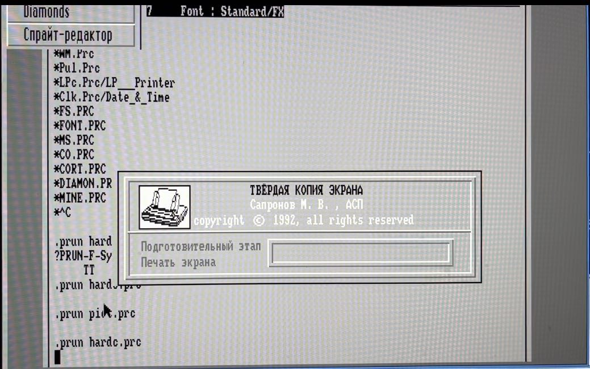

Программа печати "твёрдой копии" экрана, под АСПЕКТ.

Авторы: группа А.С.П.

```
ТВЁРДАЯ КОПИЯ ЭКРАНА
Сапронов М. В. , АСП
copyright © 1992, all rights reserved
```

### Как запустить

 * Дождаться загрузки в RT-11 до командной строки в виде точки
 * Запустить АСПЕКТ `@asp` Enter, и дождаться его загрузки
 * Запустить процесс `prun hardc.prc` Enter

### Ссылки

* [Хламник Хобота - PK11_NEON/MAX_SAPR](https://archive.pdp-11.org.ru/vid/PK11_NEON/MAX_SAPR/) либо [pdp-11.ru - _pk11-16/MAX_SAPR/](https://mirrors.pdp-11.ru/_pk11-16/MAX_SAPR/) - см. `ms_011.dsk`

### Скриншоты


