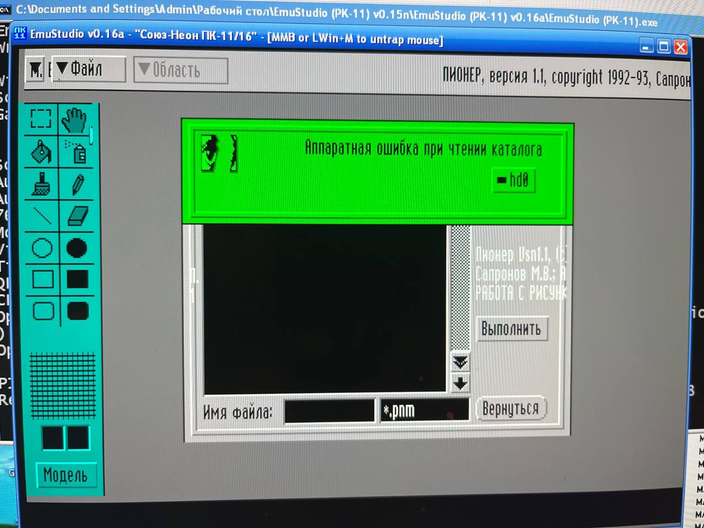
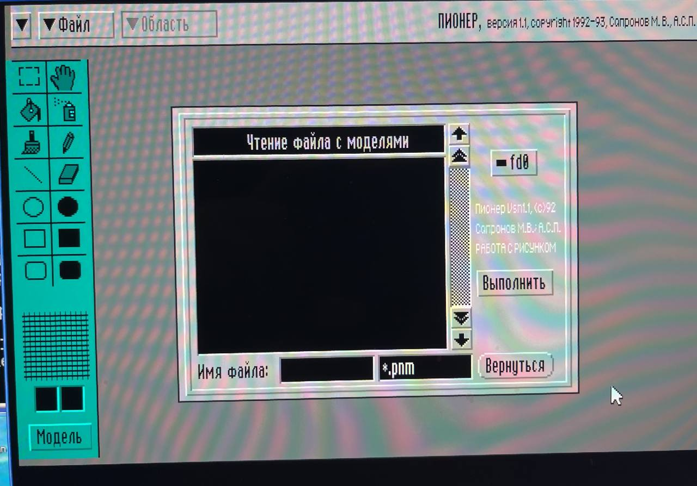
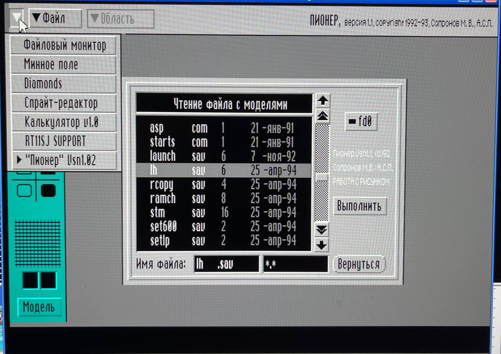

Графический редактор "ПИОНЕР" под АСПЕКТ.

Авторы: Максим Сапронов, группа А.С.П.

```
ПИОНЕР, версия 1.1, copyright 1992-93, Сапронов М.В., А.С.П.
```

### Ссылки

* [Хламник Хобота - PK11_NEON/MAX_SAPR](https://archive.pdp-11.org.ru/vid/PK11_NEON/MAX_SAPR/) либо [pdp-11.ru - _pk11-16/MAX_SAPR/](https://mirrors.pdp-11.ru/_pk11-16/MAX_SAPR/) - см. `ms_006.dsk` и `ms_007.dsk`

### Скриншоты



