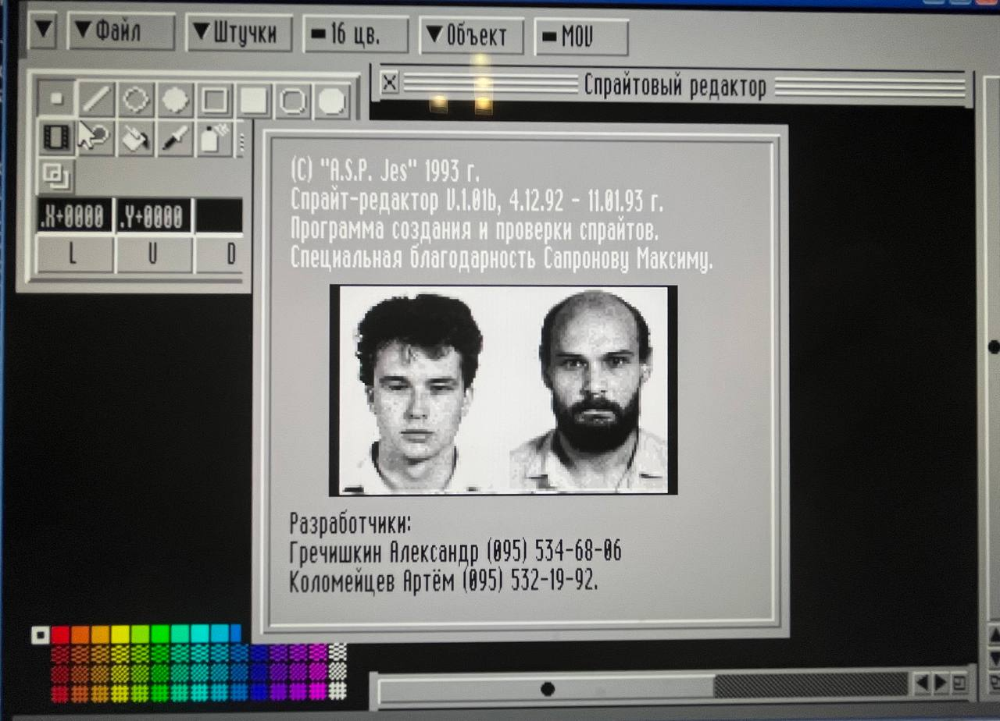
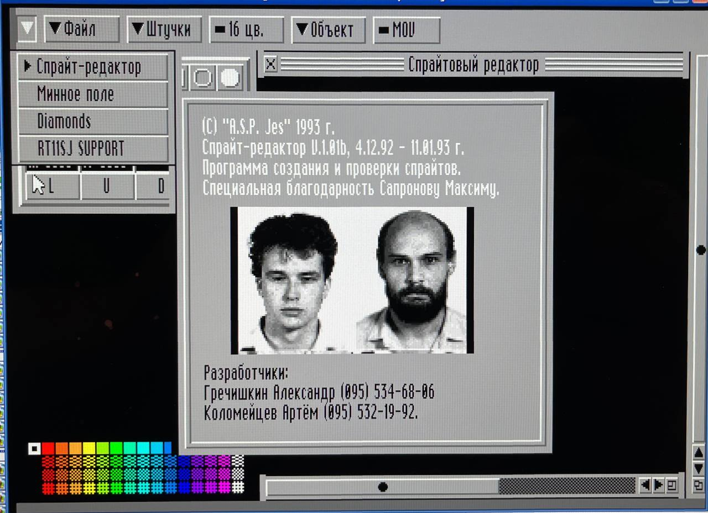

Редактор спрайтов под АСПЕКТ.

Авторы: Гречишкин Александр, Коломейцев Артём, группа А.С.П.

```
	Спрайт-редактор предназначен для создания, редактирования и проверки
спрайтов. Он является профессиональным  инструментальным  средством создания
демонстрационных, игровых и прочих зрелищных программ.
```

```
(C) "A.S.P. Jes" 1993 г.
Спрайт-редактор V.1.01b, 4.12.92 - 11.01.93 г.
Программа создания и проверки спрайтов.
Специальная благодарность Сапронову Максиму.

Разработчики:
Гречишкин Александр (095) 534-68-06
Коломейцев Артём (095) 532-19-92.
```

### Как запустить

 * Дождаться загрузки в RT-11 до командной строки в виде точки
 * Запустить АСПЕКТ `@asp` <kbd>Enter</kbd>
 * Система должна включать аниматор (`co.sav`), мышиный процесс (`ms.sav`) и суппорт RT11 (`cort.sav`)
 * Запустить спрайт-редактор как процесс `prun pict.prc` <kbd>Enter</kbd>
 * Вызвать меню АСПЕКТ по стрелке вверху слева, выбрать там `Спрайт-редактор`

### Ссылки

* [YouTube видео от Vlad Tru](https://youtu.be/rkvFMyKIkrs)

### Скриншоты


