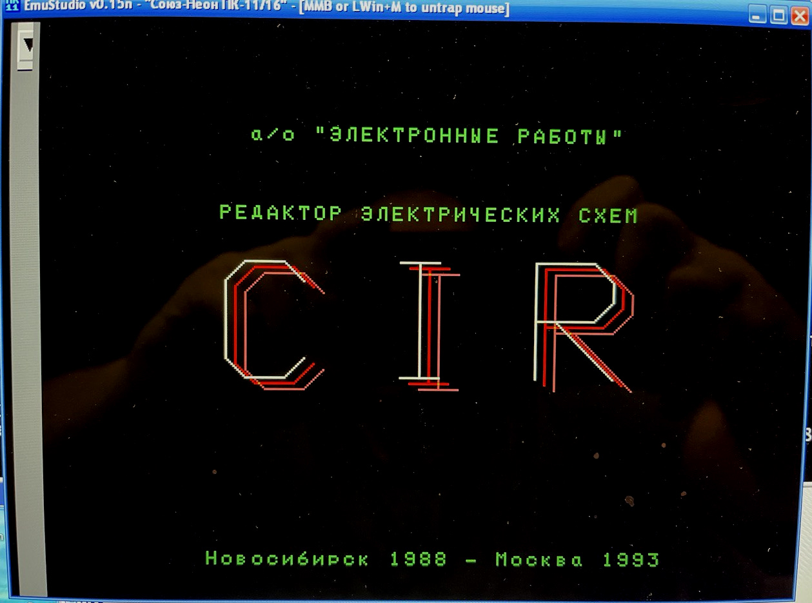

Редактор электронных схем "CIR".

Авторы: А/О "Электронные работы", 1993 год.

```
а/о "Электронные работы"
РЕДАКТОР ЭЛЕКТРИЧЕСКИХ СХЕМ
CIR
Новосибирск 1988 - Москва 1993
```

```
 Редактор  CIR  предназначен  для  создания  и   редактирования
принципиальных  схем,  хранящихся  на  диске  в  виде  двоичных
файлов.  Редактирование  схемы  осуществляется  в   графическом
диалоге при помощи небольшого и удобного набора команд.  Каждая
команда  выполняется  при  нажатии   соответствующей   клавиши.
```

CIR работает с файлами с расширением `.SCM`.

Этот редактор работает и на УКНЦ - см. [обсуждение](https://zx-pk.ru/threads/31439-sapr-pechatnykh-plat-quot-gelios-quot-(hellios-cad-calay).html?p=1054030&viewfull=1#post1054030).

Известно, что существовал файл `PKRAM.SCM` с принципиальной схемой модуля памяти для Союз-Неон.

### Скриншоты


