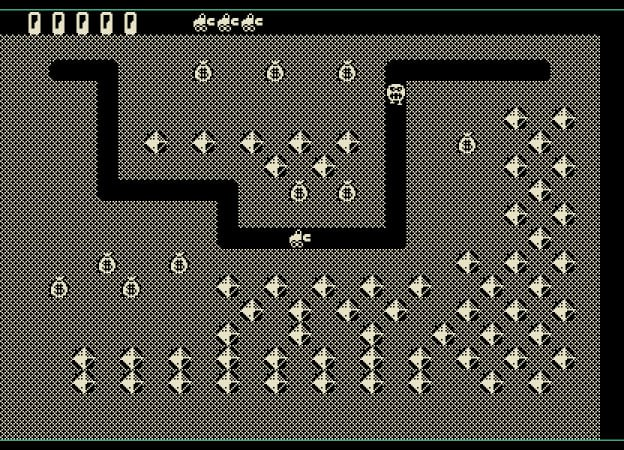

Игра "Diger" ("Землегрыз").

Авторы:
* Неизвестный автор - игра для КГД
* Alex_K - порт на Союз-Неон, 2023 год

Алексей Кислый (Alex_K) из бинарного кода игры восстановил её исходный код на Паскале.

> Сама игра написана на OMSI Pascal v.1.1 с использованием советской библиотеки PASSIM (без поддержки EIS и FIS). Полученная игра транслировалась в RT-11 пятой версии.

### Ссылки

* [Восстановленный исходник на Паскале](https://zx-pk.ru/threads/32900-igra-quot-zemlegryz-quot-dlya-dvk-kgd-i-uk-nts-!!!!.html?p=1144777&viewfull=1#post1144777) - Alex_K, январь 2022

### Скриншоты

