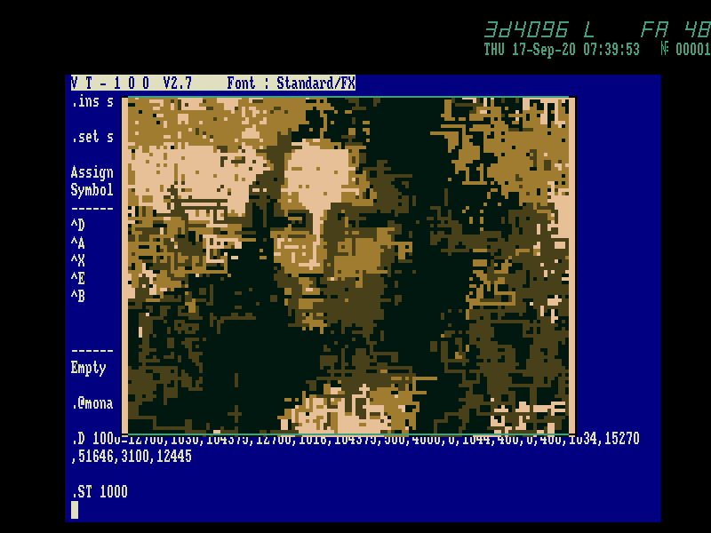

Демо программа "Мона Лиза", 498 байт.

Автор: Александр Мачуговский (Manwe), 2020 год

### Как запустить

* Дождаться загрузки в RT-11 до командной строки в виде точки
* Запустить через `@mona` Enter

### Ссылки

* [PK1116-system.dsk](http://manwe.pdp-11.ru/Disks/PK1116-system.dsk) - образ диска с демо
* [manwe-mona-pk1116.zip](https://manwe.pdp-11.ru/Demos/manwe-mona-pk1116.zip) - исходный код демо + запускаемый файл `MONA.COM`

### Скриншоты

