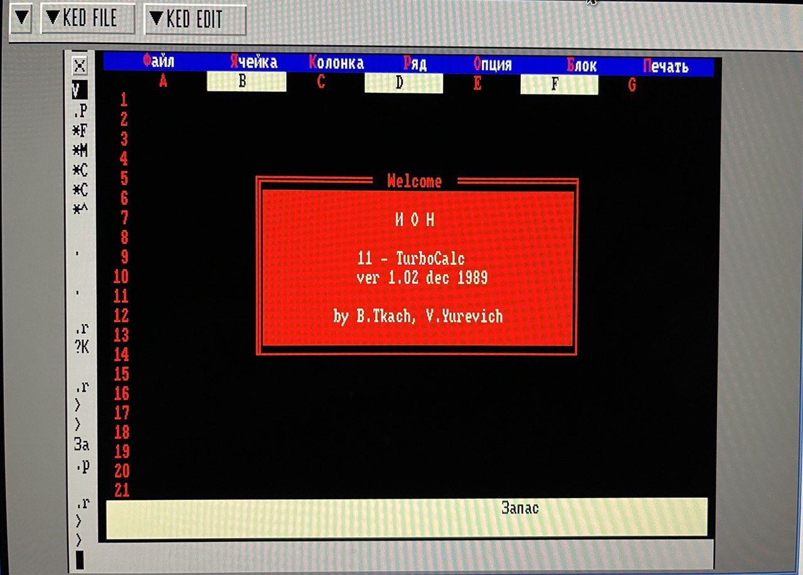

Система ведения электронных таблиц "СВЭТ 11-TurboCalc", написана для ЭВМ "ИОН-11/16", работает на Союз-Неон ПК-11/16.

Авторы: Б. Ткач, В. Юревич.

```
ИОН
11 - TurboCalc
ver 1.02 dec 1989
by B.Tkach, V.Yurevich
```

### Ссылки

* [SouzNeon_pk_11_16.rar](https://retrolib.info/_pk11-16/SouzNeon_pk_11_16.rar) - см. `SOUZ-NEON_P16DOC_LECMAC-MIET_MACRO-HLP_CALCUN_.dsk` / `CALCUN.DSK` - исполнимый файл `CALCUN.SAV`, описание, исходники на Си

### Скриншоты


